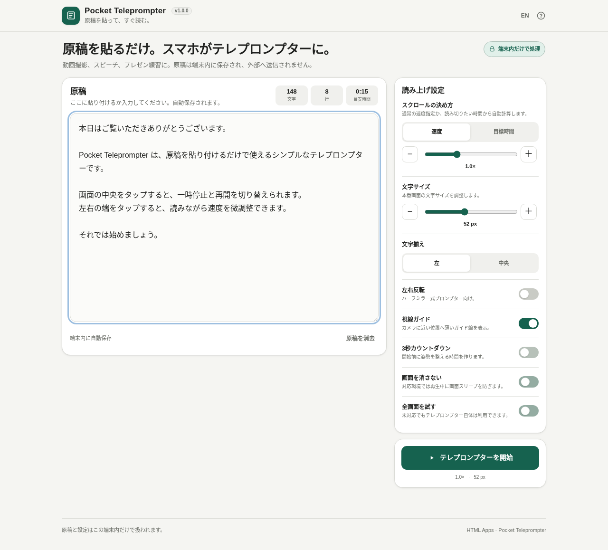

# Pocket Teleprompter

[](https://github.com/ttomohisa/htmlapps-pocket-teleprompter/actions/workflows/deploy-pages.yml)
[](LICENSE)
[](https://ttomohisa.github.io/htmlapps-pocket-teleprompter/)

[日本語版 README](README.ja.md)

A privacy-friendly, installation-free teleprompter that runs entirely in the browser. Paste a script, choose a pace, and start reading without uploading the text anywhere.

## 🚀 Live demo

### [Open Pocket Teleprompter on GitHub Pages](https://ttomohisa.github.io/htmlapps-pocket-teleprompter/)

The initial HTML is delivered by GitHub Pages. Script editing, scrolling, local saving, mirroring, timing, and reader controls run on the device. The script is not uploaded by the app.

[](https://ttomohisa.github.io/htmlapps-pocket-teleprompter/)

## Features

- Smartphone-first distraction-free teleprompter view
- Automatic scrolling with 0.5x–2.0x speed control
- **Target time mode** that calculates the scroll rate so the script ends at a selected duration
- Horizontal mirror mode for beam-splitter teleprompter rigs
- Adjustable text size and left/center alignment
- Optional eye-line guide near the camera
- Optional 3-second countdown
- Tap center to pause/resume
- Tap left/right edge to slow down/speed up
- Elapsed time, estimated remaining time, and progress
- Progressive Screen Wake Lock and Fullscreen support
- Local auto-save with no account or server storage
- Japanese and English UI in the same HTML
- No runtime dependencies or network requests

## Quick start

1. Open the web demo or `dist/index.html`.
2. Paste or type a script.
3. Adjust the pace and display settings if needed.
4. Tap **Start teleprompter**.
5. Tap the center to pause/resume. Use the left/right edge to adjust pace.

Core functions can run from a local `file://` copy. Screen Wake Lock and Fullscreen support depend on the browser and page context.

## Target time mode

Instead of guessing a scroll speed, choose how long the whole script should take—for example **3:00**. Pocket Teleprompter measures the rendered script and calculates the scroll rate so the end reaches the eye-line at approximately that time.

This controls scroll timing only; it does not analyze your voice or speaking pace.

## Keyboard shortcuts

| Shortcut | Action |
| --- | --- |
| `Space` | Pause / resume |
| `←` / `→` | Slower / faster |
| `R` | Restart |
| `F` | Try fullscreen |
| `Esc` | Exit reader when not handling browser fullscreen |

## Publish with GitHub Pages

The repository includes workflows for building and publishing the standalone HTML.

1. Push the repository as `htmlapps-pocket-teleprompter`.
2. Open **Settings → Pages → Build and deployment → Source** and select **GitHub Actions**.
3. Push to `main` or run the deploy workflow manually.
4. The app will be available at `https://ttomohisa.github.io/htmlapps-pocket-teleprompter/`.

## Development and build

```text
.
├─ src/index.template.html
├─ app.config.json
├─ dependencies.json
├─ build-standalone.bat
├─ build-standalone.ps1
├─ scripts/
└─ dist/
   ├─ index.html
   └─ index.self-extract.html
```

On Windows, run:

```bat
build-standalone.bat
```

The repository intentionally has no third-party runtime dependencies.

## Privacy

- Script text is never uploaded by the app.
- Script and preferences are stored only in browser localStorage when available.
- CSP includes `connect-src 'none'`.
- No analytics, telemetry, remote fonts, CDN assets, camera, microphone, or location access.

On a shared device, clear the script after use or clear the browser site data.

## Limitations

- Screen Wake Lock and Fullscreen availability varies by browser and page context.
- Target time is an approximate scroll completion time, not a measurement of actual speech delivery.
- Very long scripts can use more browser memory.
- Browser localStorage may be disabled or cleared by private browsing settings.

## License

Copyright © 2026 ttomohisa

Licensed under the [MIT License](LICENSE).
